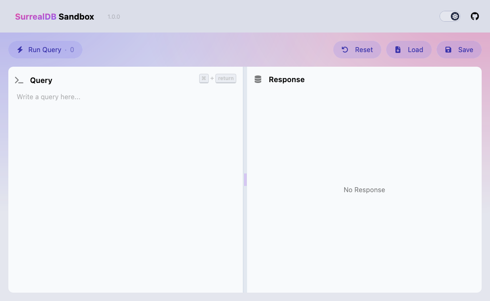

# SurrealDB Sandbox

**SurrealDB Sandbox** is a web application that allows you to experiment with SurrealDB in your browser. It provides a SurrealQL editor for writing queries and a JSON response viewer to see the results.



<div align="center"><span style="display: block; margin: 20px auto; max-width: 600px">A browser-based playground for experimenting with SurrealDB.</span></div>


▶ [Try the Live Demo](https://surrealdb-sandbox.pages.dev/)


## Features

- **SurrealQL Query Editor**: Write SurrealDB queries using the built-in editor. (Currently just a plaintext editor)
- **JSON Response Viewer**: View the JSON responses generated by your queries.
- **Interactive Sandbox** : Experiment with SurrealDB without the need to set up a local environment.
- **Save/Load Database**: Save and load your current session to local browser storage, or load an provided example.

## Getting Started

### Prerequisites

Make sure you have Node.js installed.

### Installation

Clone the repository and install dependencies:
```bash
git clone https://github.com/plasmatech8/surrealdb-sandbox
cd surrealdb-sandbox
npm install
```

Start the development server:
```bash
npm run dev
```

## License

This project is licensed under the MIT License - see the [LICENSE](LICENSE) file for details.
